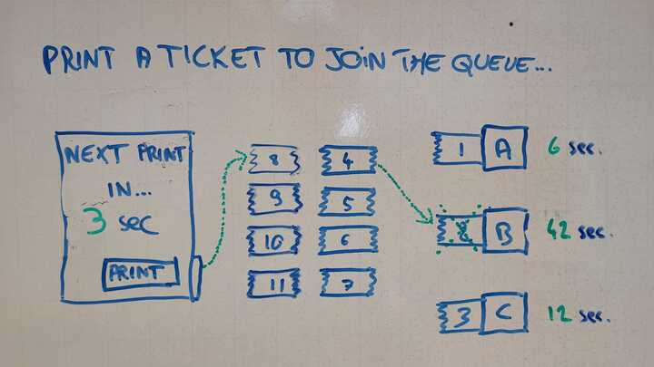

## Ticket queue challenge

Make an interactive interface representing a ticket dispenser, a queue and 3 proccessing booths.
Functional requirements come as follows:

- The ticket dispenser prints a new ticket automatically, every 8 seconds. A countdown shows remaining seconds before next ticket print.
- The ticket dispenser has a button to allow the user to print a ticket manually before the end of the autoprint delay.
- Each ticket spends a random amount of time at a booth, between 3 and 45seconds.
- If a booth is not processing a ticket, it should immediately take a ticket from the ticket queue. The amount of time a ticket has passed at a booth is displayed next to the booth.

Here is a wireframe of the interface :

